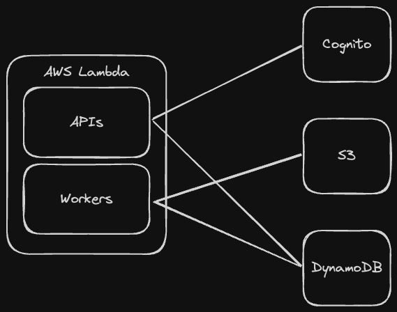

# AI App Template

A template project to run ingestion and querying with AWS services.

## Features

- Fully Rust
- Serverless (AWS Lambda)
- Deploy with [cargo lambda](https://www.cargo-lambda.info)
- File base vector graph with AWS S3
- Ingestion queue system with DynamoDB Streams
- Collection (group of documents) base search
- DynamoDB as main database
- AWS Cognito for authentication
- Slack integration
- User team

## Architecture

## Project structure

- [common](./common): Common functions, e.g jwt decode, get env var
- [composer](./composer): Compose LLMs input prompt
- [database](./database): Database module to interact with database (dynamodb)
- [document](./document): Document module to parse documents and build document nodes, to chunk document with overlapped chunking
- [helpers](./helpers): Helper functions for aws services
- [indexer](./indexer): Indexer module to build vector graph with embedding models
- [lambdas](./lambdas): AWS lambdas functions to do ingestion with SQS, querying, slack API
- [resources](./resources): PDFium resource which need to mount in AWS Index lambda to parse PDF
- [slack](./slack): Slack module to handle slack integration

## Setup

- Setup DynamoDB with stream filter which can in found in readme file.
- Mount PDFium resources to lambda need to run PDF parsing. e.g. document-indexer lambda
- Mount embedding model resources to lambda need to run embedding. e.g. document-indexer lambda and seach-api lambda
- Map API lambdas  with API gateway and set up auth

## Deployment

Every lambda function in [lambdas](./lambdas) has two deployment command.

- replace `{{IAM_ROLE}}` to AWS IAM Role for your project
- `cargo make stage`: deploy a lambda function with suffix `-stage`
- `cargo make production`: deploy a lambda function with optimized build
